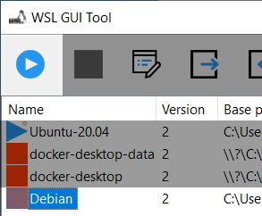

# WSL GUI tool

## Run a distribution

Select a stopped distribution (with red square) and click on blue arrow on toolbar

or you can use right click and popup menu. You can run distribution with defaut command and defaut user or with specific command and user

## Stop a distribution

Select a running distribution (with blue arrow) and click on red square on toolbar

## Export a distribution

Select a distribution (running or stopped)

then `Save file as` dialogbox appear.

The file is a tarball.

## Import a distribution

No distribution need to be selected

You need specify a folder where data is stored from tarball file.

## Clone a distribution

Select a distribution (running or stopped)

When you clone, you only need enter name. The output folder is automatically generated from original.

## Delete a distribution

Select a distribution (running or stopped)

## Set a distribution as default

Select a distribution (running or stopped)

Note: Default distribution have an asterisk on icon status.

## Change properties of a distribution

Select a distribution (running or stopped)

and change what you want

## Check job status

Because export, import, clone distribution can be long, these jobs run in background. To know status of job, check window statusbar

Job running

when you double click, a popup appear to cancel job

Job was canceled

Job finish with success

Job finish with error

when you double click, a window with run command, stdout and stderr

## Edit wslconfig file

In tool bar, click on:

then a new window is displayed:

