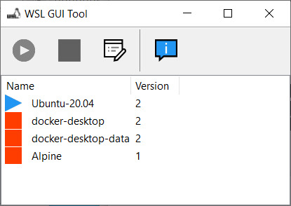
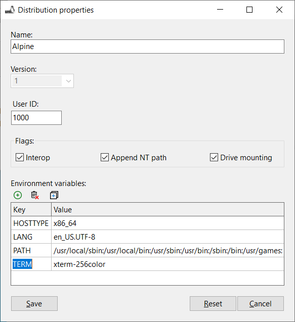

# WSL GUI tool

Windows Subsystem for Linux 2 is amazing feature of Windows that allow you run native Linux application. For more details, please read [WSL Official documentation](https://docs.microsoft.com/windows/wsl/about).

WSL GUI Tool allow you to manage WSL features with GUI and not by command line.

You can:
 * start/stop a distribution
 * rename distribution
 * change flag of distribution
 * edit default environment variables

## Installation

Just download executable file in release github section.

## Screenshot

## How to build?

You need install [Lazarus 2.0.12](https://www.lazarus-ide.org/) (fpc-3.2.0-win64) and Windows 10 64 bits.
